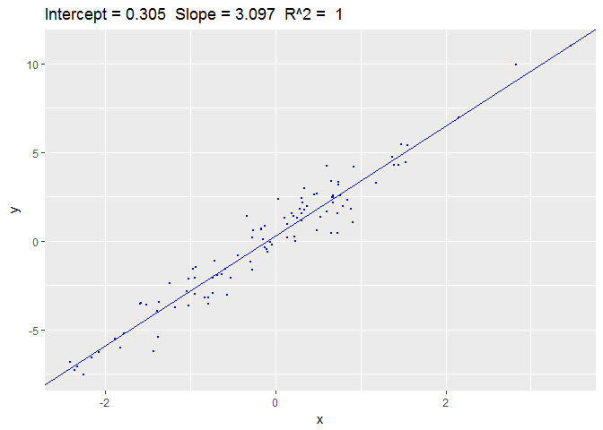

Bayesian Linear Model
=====================

### A statistical toolset for performing bayesian linear analysis on data

The purpose of this package is to provide an extensive toolset of functions for diverse functionality when analysing and intepretting data in a Bayesian statistical context.

------------------------------------------------------------------------

A short outline of the functions contained in the packages:

-   blm &lt;- function(model, alpha, beta, data,...) Takes a prior distribution of model parameters and update it to a posterior distribution, based on observed data. This results in a fitted model.

-   residuals.blm = function(object,...) Calulates the difference between predicted values and observed values for the response variable.

-   deviance.blm = function(object,...) Calculates the sum of squared distances from the predicted response variables to the observed

-   print.blm = function(x, ...) Shortly describes objects of class .blm

-   summary.blm = function(object, ...) More extensive describtion of objects of class .blm

-   plot.blm = function(object,fit = FALSE,newData = NULL,...) plots a fitted model, based on observed and fitted variables.

-   fitted.blm = function(object, ...) Calculates the fitted response variables.

-   predict.blm = function(object, newData,...) predicted values of the response variable based on a fitted model and a new set of data

-   coef.blm = function(object, ...) Extracts the coefficients from a fitted model

-   confint.blm = function(object, parm=0, level=0.95,...) confidence interval for weights

<table>
<colgroup>
<col width="100%" />
</colgroup>
<tbody>
<tr class="odd">
<td align="left">##Example of use Given a small dataset, D, beta = 1 and alpha = diag(1, nrow = 2, ncol = 2):</td>
</tr>
<tr class="even">
<td align="left">beta = 1.3 alpha = diag(1/a, nrow = 2, ncol = 2) w0 &lt;- 0.2 w1 &lt;- 3</td>
</tr>
<tr class="odd">
<td align="left">formula: y~x</td>
</tr>
<tr class="even">
<td align="left">x &lt;- rnorm(10) y &lt;- rnorm(10, mean = w0 + w1 * x, sd = sqrt(1/beta)) D = data.frame(y=y, x=x</td>
</tr>
<tr class="odd">
<td align="left">The fitted model is found by calling blm(y~x,alpha = alpha, beta = beta, data = D)</td>
</tr>
<tr class="even">
<td align="left">print():</td>
</tr>
<tr class="odd">
<td align="left"><code>## Bayesian Linear Model: ## y ~ x ## ## Call: ## blm(y ~ x, alpha = covariance, beta = b, data = D) ## ## Fitted coefficients (mean): ## (Intercept)           x ##   0.3047124   3.0970965 ## ## Covariance: ##              (Intercept)            x ## (Intercept) 0.0077172470 0.0007249637 ## x           0.0007249637 0.0062822991</code></td>
</tr>
<tr class="even">
<td align="left">Plot(): </td>
</tr>
<tr class="odd">
<td align="left">A more extensive view of the fitted model is provided calling summary. The summary demonstrates the coefficients resulting from calling coef(object,..) and the sum of squared distance from observed to estimated response variable y:</td>
</tr>
<tr class="even">
<td align="left">Summary():</td>
</tr>
<tr class="odd">
<td align="left"><code>## -------Summary Of Bayesian Linear Model------- ## ## Call: ## blm(y ~ x, alpha = covariance, beta = b, data = D) ## ## ----------------------------------------------------------------------- ## Sum of squared distance: ## 0 ## ----------------------------------------------------------------------- ## ## Coefficients (mean): ##              estimate ## (Intercept) 0.3047124 ## x           3.0970965 ## ## ## Covariance Matrix, Sigma: ##              (Intercept)            x ## (Intercept) 0.0077172470 0.0007249637 ## x           0.0007249637 0.0062822991 ## ----------------------------------------------------------------------- ## Data[1:10,]: ##             y          x ## 1  -7.0984926 -2.3277179 ## 2   3.2819136  1.1826251 ## 3  -1.4943932 -0.9419760 ## 4   1.0303605  0.9063254 ## 5   0.9610174  0.1345690 ## 6  -3.4549319 -1.3702037 ## 7  -3.5521563 -0.7958453 ## 8   0.1976728 -0.2750454 ## 9   5.4072098  1.5473990 ## 10  2.5627112  0.6751536</code></td>
</tr>
<tr class="even">
<td align="left">The model can be used to predict target variables from new datasets, using the original posterior as a prior. A new dataset is introduced:</td>
</tr>
<tr class="odd">
<td align="left">x = runif(100,-10,10) y = rnorm(n = 200, m = 0, 5) newD = data.frame(y=y, x=x)</td>
</tr>
<tr class="even">
<td align="left"><code>##     Predicted value  variance ## 1         9.6221086 0.7829622 ## 2         1.1742266 0.7731855 ## 3        -1.4224027 0.7733634 ## 4        -5.1775870 0.7762680 ## 5         8.3950597 0.7805588 ## 6        -4.9333683 0.7759840 ## 7        -5.9099765 0.7771993 ## 8         6.5405640 0.7775606 ## 9        -6.6224670 0.7782196 ## 10       -4.0871775 0.7751021 ## 11       -4.7021665 0.7757272 ## 12        3.9536322 0.7746535 ## 13        6.6874767 0.7777703 ## 14        2.7099079 0.7737846 ## 15       -5.5905200 0.7767785 ## 16        0.5565563 0.7730922 ## 17        7.0349366 0.7782852 ## 18        5.7998553 0.7765764 ## 19        8.8748134 0.7814587 ## 20       -6.2026011 0.7776047 ## 21       -9.1044093 0.7826535 ## 22        1.6765080 0.7733239 ## 23       -6.7123819 0.7783563 ## 24       -8.0545890 0.7806111 ## 25        5.2734111 0.7759510 ## 26       -9.0758353 0.7825947 ## 27       -6.3151752 0.7777657 ## 28        7.4057078 0.7788643 ## 29       -0.4884882 0.7731271 ## 30       -3.7548977 0.7747993 ## 31        9.1675495 0.7820329 ## 32        9.4407320 0.7825859 ## 33        8.6003921 0.7809377 ## 34       -9.4503635 0.7833801 ## 35        1.5790469 0.7732926 ## 36        1.7796441 0.7733592 ## 37        2.0498008 0.7734629 ## 38       -4.5862150 0.7756030 ## 39        6.1265779 0.7769955 ## 40       -6.2239500 0.7776350 ## 41        1.4134177 0.7732444 ## 42       -6.4258954 0.7779268 ## 43        1.3582726 0.7732297 ## 44        6.3742228 0.7773290 ## 45       -2.7904072 0.7740591 ## 46       10.2883455 0.7844072 ## 47        0.9487834 0.7731416 ## 48       -1.7745546 0.7735028 ## 49        2.2254970 0.7735391 ## 50       -1.5038738 0.7733932 ## 51        6.3324871 0.7772718 ## 52       -3.4626546 0.7745532 ## 53       -2.3531553 0.7737916 ## 54       -0.3393078 0.7731073 ## 55        3.8721496 0.7745860 ## 56       -5.8316051 0.7770940 ## 57       10.0177375 0.7838084 ## 58       -0.1145442 0.7730867 ## 59        9.6070637 0.7829307 ## 60        0.4134078 0.7730826 ## 61        7.1708916 0.7784940 ## 62       -6.4527449 0.7779663 ## 63        8.6549343 0.7810399 ## 64        6.7466940 0.7778561 ## 65        7.1233712 0.7784206 ## 66       -0.7251852 0.7731687 ## 67       -3.8592407 0.7748917 ## 68       -3.5425331 0.7746186 ## 69       -6.2488085 0.7776705 ## 70       -8.8328452 0.7821017 ## 71        3.7659426 0.7745004 ## 72        9.7778092 0.7832911 ## 73       -4.8827009 0.7759267 ## 74        5.0021680 0.7756528 ## 75       -7.6391702 0.7798705 ## 76        1.2792928 0.7732098 ## 77        9.7177404 0.7831636 ## 78       -7.2056685 0.7791385 ## 79        7.8237775 0.7795538 ## 80       -9.7453896 0.7840208 ## 81        2.2855012 0.7735667 ## 82        1.1059984 0.7731710 ## 83       -3.0262021 0.7742210 ## 84        5.7492820 0.7765137 ## 85       -7.0323291 0.7788575 ## 86      -10.1341403 0.7848944 ## 87        0.4125430 0.7730826 ## 88       -1.4617130 0.7733776 ## 89        2.1853794 0.7735211 ## 90        7.1553320 0.7784699 ## 91       -5.6542658 0.7768606 ## 92        5.3371554 0.7760234 ## 93       -1.2543501 0.7733066 ## 94       -9.2023872 0.7828566 ## 95       -3.0986034 0.7742732 ## 96       -3.8769193 0.7749077 ## 97       -2.7489156 0.7740319 ## 98        5.8002202 0.7765769 ## 99       -2.6607296 0.7739753 ## 100      -3.6402425 0.7747005 ## 101       9.6221086 0.7829622 ## 102       1.1742266 0.7731855 ## 103      -1.4224027 0.7733634 ## 104      -5.1775870 0.7762680 ## 105       8.3950597 0.7805588 ## 106      -4.9333683 0.7759840 ## 107      -5.9099765 0.7771993 ## 108       6.5405640 0.7775606 ## 109      -6.6224670 0.7782196 ## 110      -4.0871775 0.7751021 ## 111      -4.7021665 0.7757272 ## 112       3.9536322 0.7746535 ## 113       6.6874767 0.7777703 ## 114       2.7099079 0.7737846 ## 115      -5.5905200 0.7767785 ## 116       0.5565563 0.7730922 ## 117       7.0349366 0.7782852 ## 118       5.7998553 0.7765764 ## 119       8.8748134 0.7814587 ## 120      -6.2026011 0.7776047 ## 121      -9.1044093 0.7826535 ## 122       1.6765080 0.7733239 ## 123      -6.7123819 0.7783563 ## 124      -8.0545890 0.7806111 ## 125       5.2734111 0.7759510 ## 126      -9.0758353 0.7825947 ## 127      -6.3151752 0.7777657 ## 128       7.4057078 0.7788643 ## 129      -0.4884882 0.7731271 ## 130      -3.7548977 0.7747993 ## 131       9.1675495 0.7820329 ## 132       9.4407320 0.7825859 ## 133       8.6003921 0.7809377 ## 134      -9.4503635 0.7833801 ## 135       1.5790469 0.7732926 ## 136       1.7796441 0.7733592 ## 137       2.0498008 0.7734629 ## 138      -4.5862150 0.7756030 ## 139       6.1265779 0.7769955 ## 140      -6.2239500 0.7776350 ## 141       1.4134177 0.7732444 ## 142      -6.4258954 0.7779268 ## 143       1.3582726 0.7732297 ## 144       6.3742228 0.7773290 ## 145      -2.7904072 0.7740591 ## 146      10.2883455 0.7844072 ## 147       0.9487834 0.7731416 ## 148      -1.7745546 0.7735028 ## 149       2.2254970 0.7735391 ## 150      -1.5038738 0.7733932 ## 151       6.3324871 0.7772718 ## 152      -3.4626546 0.7745532 ## 153      -2.3531553 0.7737916 ## 154      -0.3393078 0.7731073 ## 155       3.8721496 0.7745860 ## 156      -5.8316051 0.7770940 ## 157      10.0177375 0.7838084 ## 158      -0.1145442 0.7730867 ## 159       9.6070637 0.7829307 ## 160       0.4134078 0.7730826 ## 161       7.1708916 0.7784940 ## 162      -6.4527449 0.7779663 ## 163       8.6549343 0.7810399 ## 164       6.7466940 0.7778561 ## 165       7.1233712 0.7784206 ## 166      -0.7251852 0.7731687 ## 167      -3.8592407 0.7748917 ## 168      -3.5425331 0.7746186 ## 169      -6.2488085 0.7776705 ## 170      -8.8328452 0.7821017 ## 171       3.7659426 0.7745004 ## 172       9.7778092 0.7832911 ## 173      -4.8827009 0.7759267 ## 174       5.0021680 0.7756528 ## 175      -7.6391702 0.7798705 ## 176       1.2792928 0.7732098 ## 177       9.7177404 0.7831636 ## 178      -7.2056685 0.7791385 ## 179       7.8237775 0.7795538 ## 180      -9.7453896 0.7840208 ## 181       2.2855012 0.7735667 ## 182       1.1059984 0.7731710 ## 183      -3.0262021 0.7742210 ## 184       5.7492820 0.7765137 ## 185      -7.0323291 0.7788575 ## 186     -10.1341403 0.7848944 ## 187       0.4125430 0.7730826 ## 188      -1.4617130 0.7733776 ## 189       2.1853794 0.7735211 ## 190       7.1553320 0.7784699 ## 191      -5.6542658 0.7768606 ## 192       5.3371554 0.7760234 ## 193      -1.2543501 0.7733066 ## 194      -9.2023872 0.7828566 ## 195      -3.0986034 0.7742732 ## 196      -3.8769193 0.7749077 ## 197      -2.7489156 0.7740319 ## 198       5.8002202 0.7765769 ## 199      -2.6607296 0.7739753 ## 200      -3.6402425 0.7747005</code></td>
</tr>
<tr class="odd">
<td align="left">This allows for continuous optimization of the model as more data (under the same formula) is introduced.</td>
</tr>
</tbody>
</table>

To install the package: install.packages("blm") library(blm)

------------------------------------------------------------------------
